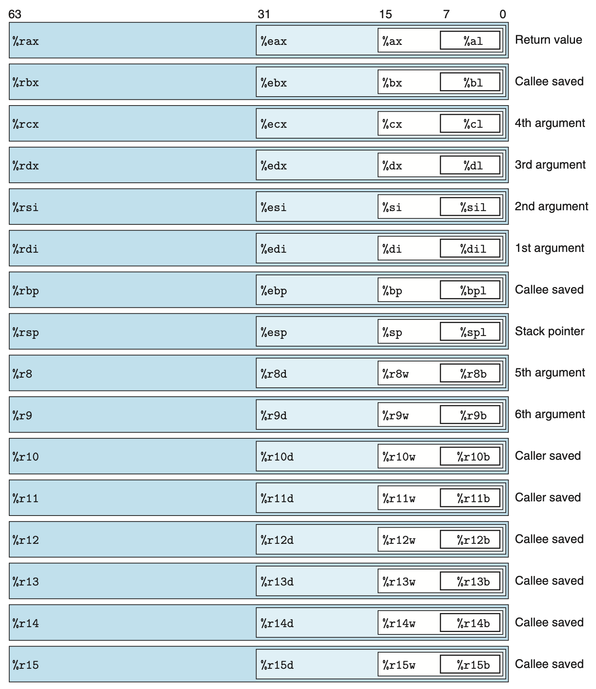

# CPU 体系结构  （X86-64)

## CPU 寄存器

- 通用寄存器如rax
- 特殊寄存器如rip,rsp
- 标志位

## 使用惯例

- rax：返回值
- rsp：栈指针
- rbp：基址指针（非必须）
  
- 调用者保存：
  - r10
  - r11
- 被调者保存：
  - rbx
  - ebp
  - r12
  - r13
  - r14
  - r16

> 假如函数f调用函数g，那么函数f需要先把r10和r11的值压栈保存起来（如果它用到这个两个寄存器的话），因为函数g会直接覆盖里面的内容（如果它需要的话）。

参数传递：
- rdi 第1个参数
- rsi 第2个参数
- rdx 第3个参数
- rcx 第4个参数
- r8  第5个参数
- r9  第6个参数
- TODO： 其他参数