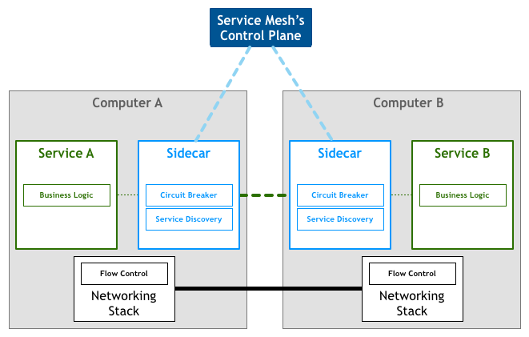
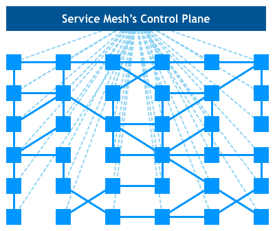

# 理解Istio 路由API

本文采用Isito的Evaluation Install（https://istio.io/docs/setup/install/kubernetes/），并结合其中的bookinfo例子（https://istio.io/docs/examples/bookinfo/#deploying-the-application）对Istio的 v1apha3 路由API进行简要的介绍。

## Service Mesh 简介

在《API 网关 kong 实战》(https://cloud.tencent.com/developer/article/1477672)一文中，我们介绍了为什么要采用API网关“ 如果让每一个后台系统都实现鉴权、限流、负载均衡、审计等基础功能是不合适的，通用的做法是把这些功能抽离出来放到网关层。”这解决了外部请求访问服务的问题，但是微服务之间的内部调用也需要进行鉴权、限流、负载均衡，一种简单的解决方案是让微服务之间的调用也通过网关进行，然而这种方案有有很多问题：

1. 网关成为了一个单点，虽然我们可以通过横向扩展解决
2. 微服务之间的调用加重了网关的负载，这些流量*本来*可以不经过网关
3. 内部调用和外部请求的鉴权、限流等策略是相同的，无法根据内外部调用来区别对待

正如API网关是在流量入口处设置一个反向代理，service mesh的做法是为每一个微服务部署一个代理，这些代理通过iptables劫持所有进入服务的流量，完成鉴权、限流等步骤后再把请求发送到后端服务中，因此service mesh对应用程序来说是透明的。在Istio的实现中，这个代理采用了Envoy，通过Sidecar方式实现，如下图所示：


> 
> 
> 图片来自[Pattern: Service Mesh](https://philcalcado.com/2017/08/03/pattern_service_mesh.html)

多个微服务之间相互调用的时候，形成了服务网格(Service Mesh)，sidecar proxy和service之间的业务流量是数据面，而每个sidecar proxy还跟Control Plane相连，这是控制面，用于下发配置和规则。

> 
> 
> 图片来自[Pattern: Service Mesh](https://philcalcado.com/2017/08/03/pattern_service_mesh.html)

同时，为了允许外部服务访问网格内部的资源，Istio同样提供了Gateway。

## Istio 路由API

> 一个典型的服务网格会有一个或多个负载均衡器(load balancer)来接受外部网络的请求，并允许这些请求访问网格内部的服务，这些请求通过Sidecar网关在内部服务之间交互。网关内部的应用通常也需要访问外部服务（比如Google Maps API)，可以是直接调用，也可以强制要求这些请求简介通过egress gateway出去。

在Istio for kubernetes的部署中，上面的load balancer可以简单理解为kubernetes的load balancer，而Sidcar网关，我理解为容器的sidecar envoy proxy。


Istio v1alpha3路由模型引入了4种配置资源，分别是
1. Gateway
2. VirtualService
3. DestinationRule
4. ServiceEntry

这些资源的控制流如下图所示


关于这四种资源的详细介绍请参考

-  Istio的官方博客:《Introducing the Istio v1alpha3 routing API》（https://istio.io/blog/2018/v1alpha3-routing/）
-  《Istio服务网格中的网关》(https://www.yangcs.net/posts/istio-ingress/）


下面以结合bookinfo例子https://istio.io/docs/examples/bookinfo/#deploying-the-application）介绍每一个资源，在阅读下面内容前，建议先对bookinfo有一个大概的了解。

### Gateway

Istio的Gateway其实是运行在Kubernetes中的一组工作负载，可以有多个Gateway的工作负载共存，它们也可以有多个实现，虽然目前Istio支持的只有Envoy，理论上其他实现了xDS协议的程序也可以作为Gateway。

Bookinfo的网关配置（samples/bookinfo/networking/bookinfo-gateway.yaml）如下：
```
apiVersion: networking.istio.io/v1alpha3
kind: Gateway
metadata:
  name: bookinfo-gateway
spec:
  selector:
    istio: ingressgateway # use istio default controller
  servers:
  - port:
      number: 80
      name: http
      protocol: HTTP
    hosts:
    - "*"
```

这个配置的意思是，在所有符合spec.selector指定标签中的pod中通过80端口监听http请求，接受来自所有主机名的请求

其中spec.selector是istio: ingressgateway，来看看这是个什么pod
```
# kubectl get pods -listio=ingressgateway -n istio-system
NAME                                    READY   STATUS    RESTARTS   AGE
istio-ingressgateway-54f6c8db59-tp8jl   1/1     Running   0          21d
```

如果你在创建gateway资源之前登入这个pod，可以看到envoy只监听了两个端口，15000是Envoy admin port (commands/diagnostics)，15090是Proxy
```
# kubectl exec -it istio-ingressgateway-54f6c8db59-tp8jl /bin/sh -n istio-system
# netstat -ntlup
Active Internet connections (only servers)
Proto Recv-Q Send-Q Local Address           Foreign Address         State       PID/Program name
tcp        0      0 0.0.0.0:15090           0.0.0.0:*               LISTEN      28/envoy        
tcp        0      0 127.0.0.1:15000         0.0.0.0:*               LISTEN      28/envoy        
tcp6       0      0 :::15020                :::*                    LISTEN      1/pilot-agent   
```

在pod中执行一个循环去检查端口监听的情况`while true; do date; netstat -ntlup; sleep 1; done`，然后在另一个终端中创建gateway资源

```
# kubectl get gw
No resources found.
# date; kubectl apply -f bookinfo-gateway.yaml ; kubectl get gw -w
Sun Oct 13 15:30:00 CST 2019
gateway.networking.istio.io/bookinfo-gateway created
virtualservice.networking.istio.io/bookinfo unchanged
NAME               AGE
bookinfo-gateway   0s
```

回到gateway pod中，我们可以看到大约在命令执行两秒后envoy开始监听80端口：
```
#  while true; do date; netstat -ntlup; sleep 1; done
...
Active Internet connections (only servers)
Proto Recv-Q Send-Q Local Address           Foreign Address         State       PID/Program name
tcp        0      0 0.0.0.0:15090           0.0.0.0:*               LISTEN      28/envoy        
tcp        0      0 127.0.0.1:15000         0.0.0.0:*               LISTEN      28/envoy        
tcp6       0      0 :::15020                :::*                    LISTEN      1/pilot-agent   
Sun Oct 13 07:30:02 UTC 2019
Active Internet connections (only servers)
Proto Recv-Q Send-Q Local Address           Foreign Address         State       PID/Program name
tcp        0      0 0.0.0.0:80              0.0.0.0:*               LISTEN      28/envoy        
tcp        0      0 0.0.0.0:15090           0.0.0.0:*               LISTEN      28/envoy        
tcp        0      0 127.0.0.1:15000         0.0.0.0:*               LISTEN      28/envoy        
tcp6       0      0 :::15020                :::*                    LISTEN      1/pilot-agent   
```


我们现在知道这些gateway的workload是怎么处理Gateway资源并创建对应的监听端口的，可是外部请求是怎么进来的呢？在Istio Evaluation Install中默认部署了一个type为LoadBalancer的服务：
```
# kubectl get svc -n istio-system -l istio=ingressgateway -o yaml
apiVersion: v1
items:
- apiVersion: v1
  kind: Service
  metadata:
    annotations:
      ...
    creationTimestamp: 2019-09-21T14:10:17Z
    labels:
      app: istio-ingressgateway
      chart: gateways
      heritage: Tiller
      istio: ingressgateway
      release: istio
    name: istio-ingressgateway
    namespace: istio-system
    resourceVersion: "8604840388"
    selfLink: /api/v1/namespaces/istio-system/services/istio-ingressgateway
    uid: 8a23bbe1-dc79-11e9-a35b-ea6d8aa3e629
  spec:
    clusterIP: 172.19.63.164
    externalTrafficPolicy: Cluster
    ports:
    ...
    - name: http2
      nodePort: 31380
      port: 80
      protocol: TCP
      targetPort: 80
    ...
    selector:
      app: istio-ingressgateway
      istio: ingressgateway
      release: istio
    sessionAffinity: None
    type: LoadBalancer
  status:
    loadBalancer:
      ingress:
      - ip: <load balancer ip>
kind: List
metadata:
  resourceVersion: ""
  selfLink: ""
```

通过里面的selector我们可以看到正是这个服务把请求发送到刚才看到的pod中
```
# kubectl get pods -lapp=istio-ingressgateway,istio=ingressgateway,release=istio -n istio-system
NAME                                    READY   STATUS    RESTARTS   AGE
istio-ingressgateway-54f6c8db59-tp8jl   1/1     Running   0          21d
```

而这个pod是istio-ingressgateway这个deployment的一个实例，可以进行水平扩展
```
# kubectl get deployment istio-ingressgateway -n istio-system
NAME                   DESIRED   CURRENT   UP-TO-DATE   AVAILABLE   AGE
istio-ingressgateway   1         1         1            1           21d
```


### VirtualService

Gateway接受到请求后，需要根据请求所附带的信息进行路由转发，对于http请求来说通产包括主机名、端口号、请求路径等。在Istio中，这是通过VirtualService实现的。在bookinfo-gateway.yaml中还包含了下面内容：

```
apiVersion: networking.istio.io/v1alpha3
kind: VirtualService
metadata:
  name: bookinfo
spec:
  hosts:
  - "*"
  gateways:
  - bookinfo-gateway
  http:
  - match:
    - uri:
        exact: /productpage
    - uri:
        prefix: /static
    - uri:
        exact: /login
    - uri:
        exact: /logout
    - uri:
        prefix: /api/v1/products
    route:
    - destination:
        host: productpage
        port:
          number: 9080
```

这里通过`spec.gateways`跟刚才创建的bookinfo-gateway关联，也就是说这个gateway上收到的请求，如果它们的请求路径匹配/productpage、/static、/login、/logout、或是/api/v1/products中的任何一个，将会按照route中的destination进行转发，这里的目标productpage其实也是kubernetes中的一个service

```
# kubectl get svc productpage
NAME          TYPE        CLUSTER-IP      EXTERNAL-IP   PORT(S)    AGE
productpage   ClusterIP   172.19.63.254   <none>        9080/TCP   21d
```

### DestinationRule

Kubernetes支持通过使用多个不同deployment来部署同一个应用的不同版本，并通过同一个Service对外暴露服务，比如reviews这个Service实际上包含了三个不同的版本，每个版本都只有一个pod：

```
# kubectl get svc -lapp=reviews -o yaml
apiVersion: v1
items:
- apiVersion: v1
  kind: Service
  metadata:
    ...
  spec:
    clusterIP: 172.19.63.193
    ports:
    - name: http
      port: 9080
      protocol: TCP
      targetPort: 9080
    selector:
      app: reviews

# kubectl get pods -l app=reviews
NAME                          READY   STATUS    RESTARTS   AGE
reviews-v1-5787f7b87-b9vjc    2/2     Running   0          21d
reviews-v2-6d8b975647-md6x5   2/2     Running   0          21d
reviews-v3-7d5549f9-sxjn4     2/2     Running   0          21d
```

使用这种方法进行金丝雀发布无法进行精细的流量控制，比如把1%的请求流量发送到reviews-v3，因为它跟每个版本Pod的个数有关，用户请求落到v1/v2/v3每个版本的概率都是1/3。Istio的Destination Rule为这种场景提供了支持，还是以reviwes service为例，`destination-rule-all.yaml`包含这么一段：
```
apiVersion: networking.istio.io/v1alpha3
kind: DestinationRule
metadata:
  name: reviews
spec:
  host: reviews
  subsets:
  - name: v1
    labels:
      version: v1
  - name: v2
    labels:
      version: v2
  - name: v3
    labels:
      version: v3
```

比如对于subsets标记为v1的，发送到label为`version: v1`的workload中，我们可以看到这些reviews的pod确实是有个version的label
```
# kubectl get pods -l app=reviews --show-labels
NAME                          READY   STATUS    RESTARTS   AGE   LABELS
reviews-v1-5787f7b87-b9vjc    2/2     Running   0          21d   app=reviews,pod-template-hash=5787f7b87,version=v1
reviews-v2-6d8b975647-md6x5   2/2     Running   0          21d   app=reviews,pod-template-hash=6d8b975647,version=v2
reviews-v3-7d5549f9-sxjn4     2/2     Running   0          21d   app=reviews,pod-template-hash=7d5549f9,version=v3
```

Destination Rule需要配置VirutalService来使用，默认情况下，如果VirtualService中没有指定subsets配置，仅仅像上面那样指定Destination Rules跟Kuberetes的Service的负载均衡策略是一致的，流量会以均等的几率落到三个版本中。我们可以为Reviews配置一个这样的VirtualService：

```
apiVersion: networking.istio.io/v1alpha3
kind: VirtualService
metadata:
  name: reviews
spec:
  hosts:
  - reviews
  http:
  - match:
    - headers:
        end-user:
          exact: jason
    route:
    - destination:
        host: reviews
        subset: v2
  - route:
    - destination:
        host: reviews
        subset: v3
```

这个配置的意思是：
- 如果请求的包含了end-user这个header，并且它的值是jason，把这个请求发送到subsets v2
- 其余所有请求发送到subsets v3

### ServiceEntry

如上文所述，网格内部的服务通常还需要访问外部服务，有两种做法，一是直接访问，二是经由Egress Gateway间接访问。比如应用需要访问http://foo.com，它可以直接向这个地址发起请求，也可以通过ServiceEntry把http://foo.com映射为foo.service，仿佛是网格内部的一个服务， 当应用访问foo.service的时候，通过Egress Gateway出去。


ServiceEntry优点有包括：
- 可以为这个外部服务配置标准的Istio策略，比如限流
- 屏蔽遗留服务的迁移，比如一个老的以来服务暂时无法完成容器化的改造，我们可以把它映射为ServiceEntry，等这个依赖服务完成改造迁移到服务网格中后，它的消费者无需修改任何配置。

### 总结

应用程序通过Kubernetes的LoadBalancer把请求发送到Ingress Gateway，Gateway根据对应的VirtualService进行路由转发，并在转发后的Desntination Route中应用Istio的策略如流量管理等，最终访问到服务网格内部的应用。如果应用需要访问外部服务，可以发起直接的请求，也可以经由Egress Gateway应用Isto的策略后再转发出去。
