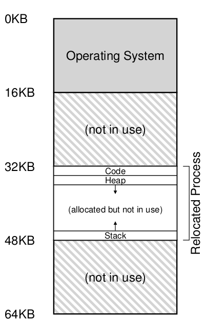
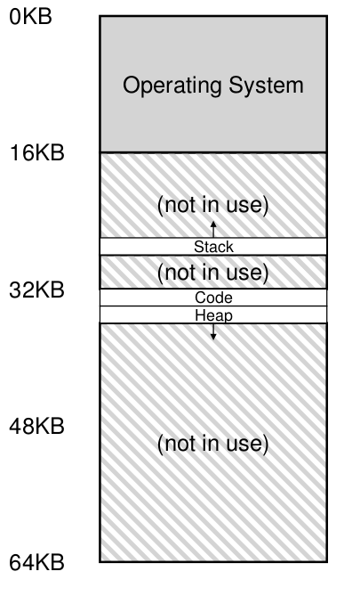

操作系统基础-内存虚拟化

# 前言

在CPU虚拟化中我们采用的是分时复用的机制——在不同的时刻运行不同的进程；而在内存虚拟化中需要用到另一种复用技术——空间复用，即把物理内存的不同部分划分给不同的进程。但是如果每个进程在运行时需要先知道自己的物理内存地址，比如说某个指针的物理地址是什么，这对编译器和开发者来说都是非常不友好的， 从易用性的角度出发，我们希望所有进程的地址空间都是类似的。因此操作系统引入了一层转换，隐式地把进程看到的地址（逻辑地址）转换成实际的物理内存地址（物理地址）。

# 进程地址空间

在研究如何进行逻辑地址到线性地址的转换前，先来看看一个进程的地址空间(Space Address)需要包含什么内容，我们先以一个非常小的地址空间为起点，它总共只有16K，也就是说这个进程只能使用16K的内存。

大体来说，这个地址空间可以分成3个段（Segment)：

1. 代码段（图中0-1KB的部分），程序的二进制指令保存在这里
2. 用来存放动态数据的堆（Heap，图中1-2KB的部分）， malloc的内存就从这里申请，当现有堆大小不够的时候往高地址扩展
3. 用来追踪函数调用的栈（Stack，途中16-15KB的部分），里面保存了每个函数调用中的局部变量，参数等信息，每层函数调用都会导致堆往低地址扩展

这个地址空间忽略了很多东西，比如代码段和堆之前还有全局变量，BSS段等。但是我们可以看到，这个地址空间是相当稀疏的，堆和栈之间有一大片地址没有利用起来。

假设我们有很多个进程，怎么把每个进程的逻辑地址空间映射到物理地址呢？

# Base and Bounds

最简单的机制叫做Base and Bounds，因为每个进程的地址空间大小都是固定，只需要把物理内存按照同样的大小分割，按需分配给不同的进程即可。比如下图中，物理地址的32-48K被分配给了一个进程。

具体实现上，CPU上有两个寄存器用来记录这些信息：
- Base 寄存器用来记录当前进程在物理内存的起始位置(32K)
- Bounds 寄存器用来记录该进程地址空间的边界（16K）

> 毫无疑问，这两个寄存器的值在上下切换的时候需要保存到PCB中。

操作系统在做逻辑地址到物理地址的转换时非常容易，只要给逻辑地址加上Base寄存器的值即可。然而这种模式有很严重的问题:

1. 这个地址空间太小，虽然我们可以放大这个地址空间（比如说640K……），但无论如何不能超过物理内存的大小
2. 更严重的问题是，堆和栈之间有一大片分配了却没有使用的地址，地址空间越大，这里的浪费越明显。

# 段式寻址

为了解决Base and Bounds的问题，人们引入了段式寻址(Segmentation)，其核心思路是，为地址空间的每一个段（Segment）分配一组Base和Bounds寄存器。进程的代码段，堆和栈可以分配到物理内存的不同位置，而不需要占据连续的空间：

这里有一个问题，当进程引用一个逻辑地址的时候，怎么知道它是那个段呢？VAX/VMS里面采用了地址的前两位来区分

| 地址前两位 | 段   |
| ---------- | ---- |
| 00         | 代码 |
| 01         | 堆   |
| 10         | 栈   |
| 11         | 内核 |

段式寻址带来的另一个好处是，如果运行同一个程序的多个副本时，因为代码段是只读的，这些进程的代码段可以映射到同一个物理内存区域。

但是段式寻址没有解决根本问题，假如一个进程申请了一个巨大的堆，比如说1GB，然后释放了这1GB里面大部分的空间，只留下开头和结尾各1KB的空间，这同样导致了一个巨大的浪费。我们需要更精细的内存分配手段。

# Pagetable

最终的解决方案是pagetable。
