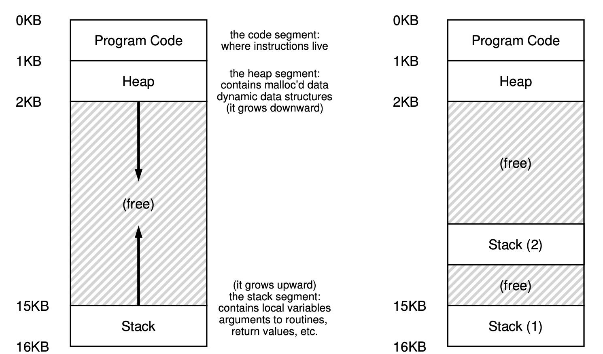

操作系统基础 - 线程级并发

# 前言

在前面的系列文章中，我们了解了操作系统如何通过CPU和内存的虚拟化完成了多进程的并发。进程级的并发存在一些性能问题：

- 进程间通讯相对比较复杂，需要操作系统提供专门的系统调用来支持。
- 创建一个进程的开销比较大，因此像是传统的基于fork的web server很难承载高并发请求的场景。

# 线程

操作系统提供了线程来解决这些问题，在同一个进程地址空间内实现了多个逻辑控制流（即线程），它们可以像进程一样调度，具体实现上：

- 每个线程对应一个栈，因此一个使用多线程的进程中有多个栈，而不是一个
- 这些线程共享代码段、全局数据段、以及堆，线程间通讯直接通过全局数据段或堆来完成，避免了复杂的IPC机制

> CPU在切换线程的时候，依然需要上下文切换，但是这里不需要切换页表



*图1 - 单线程和多线程地址空间*

多线程并发需要解决的问题主要有两个：

- 多个线程同时存取共享数据的时候，如何保证其原子性，操作系统提供了互斥锁(lock)来解决这个问题
- 如何同步多个线程的执行顺序，最典型的场景是生产者消费者问题，解决方案是条件变量(condition variable)

# 互斥锁

## 问题描述

下面这个程序通过两个线程累加一个计数器，正常情况下它的输出应该是输入值的两倍：

```C
#include <stdio.h>
#include <stdlib.h>
#include <pthread.h>

static volatile int counter = 0;

void *mythread(void *arg)
{
    int i;
    int n = (int)arg;
    for (i = 0; i < n; i++)
    {
        counter = counter + 1;
    }
    return NULL;
}

int main(int argc, char *argv[])
{
    pthread_t p1, p2;
    int n = atoi(argv[1]);

    pthread_create(&p1, NULL, mythread, (void *)n);
    pthread_create(&p2, NULL, mythread, (void *)n);

    pthread_join(p1, NULL);
    pthread_join(p2, NULL);

    printf("Counter: %d\n", counter);
    return 0;
}

```

我们可以看到在循环次数少的时候，程序能输出正确的结果，但是循环次数高了之后，结果是无法预期的

```bash
# ./concurrent 1000
Counter: 2000
# ./concurrent 10000000
Counter: 16086576
# ./concurrent 10000000
Counter: 14018391
```

这里的原因在于，CPU执行`counter = counter + 1`的时候不是原子的，它实际是三条指令

```asm
mov 0x8049a1c, %eax     ; 假设0x8049a1c是counter的地址
add $0x1, %eax
mov %eax, 0x8049a1c
```

两个线程A和B同时执行这条语句的时候，可能出现类似这样的情况：

- A和B都执行了第一条语句，把同样的值存到%eax中
- A执行第二和第三条语句，把结果写回counter的内存地址
- B执行第二和第三条语句，把结果写回counter的内存地址，把A的结果覆盖了

这个问题可以通过简单的加互斥锁来解决

```C
pthread_mutex_t lock = PTHREAD_MUTEX_INITIALIZER;

pthread_mutex_lock(&lock);
counter = counter + 1;
pthread_mutex_unlock(&lock);
```

pthread是怎么实现互斥锁这个机制的呢？ 下面假设我们要实现一个类似phread的线程库，请注意以下的伪代码都是运行在用户态而非内核态的。

## 自旋锁

最简单的机制称为自旋锁(Spin Lock)，需要加锁的线程不停地去检查lock的状态，一旦发现lock的状态是没有上锁的，就把它锁上然后继续线程的执行逻辑。用C语言描述的话，类似这样：

```C
typedef struct __lock_t {int flag;} lock_t;

void init (lock_t *mutex) {
    // 0 表示未上锁，1 表示上锁
    mutex->flag = 0;
}

void lock (lock_t *mutex) {
    while (mutex->flag == 1)
        ;   // 自旋等待其他线程释放锁
    mutex->flag = 1;
}

void unlock (lock_t *mutex) {
    mutex->flag = 0;
}
```

先不论性能，这个简单的锁在实现上是有bug的，问题在于测试和设置mutex->flag之间不是原子的，下面的场景会导致两个线程同时拿到锁：

1. 线程A发现 mutex 没有上锁，因此退出了循环，在运行`mutex->flag = 1`之前系统把线程A切换出去了运行线程B
2. 线程B同样发现 mutex 没有上锁，因此退出循环设置`mutext->flag = 1`，这是线程B认为自己拿到了锁
3. 操作系统重新调度运行线程A的时候执行`mutex->flag = 1`，线程A也认为自己拿到了锁

要解决这个问题，需要硬件提供原子性指令支持，下面我们来看两个常见的指令：

### Test-And-Set

`Test-And-Set`也称为`atomic exchagne`，在x86中叫做`xchg` ,这条指令用C语言描述的话，大概是这样：

```C
int TestAndSet (int *old_ptr, int new) {
    int old = *old_ptr;     // 存储old_ptr原始的值
    *old_ptr = new;         // 把新的值写到old_ptr
    return old;             // 返回原始的值
}
```

这条指令返回old_ptr指向的原始值，同时把old_ptr的内容改为new，这个过程是原子的。Spin Lock基于Test-And-Set的实现如下:

```C
void lock (lock_t *mutex) {
    while (TestAndSet(&lock->falg, 1) == 1)
        ;       //自旋等待
    mutex->flag = 1;
}
```

如果锁之前被别的线程占有了，等待锁的线程会一次又一次地把flag设为1，只有锁被释放flag=0的时候，等待线程根据返回值知道自己获取了锁。

### Compare-And-Swap

`Compare-And-Swap`在x86中叫做`compare-and-exchagne`，伪代码实现如下：

```C
int CompareAndSwap (int *ptr, int expected, int new) {
    int actual = *ptr;
    if (actual == expected)
        *ptr = new;
    return actual;
}
```

只有ptr指向的值等于expected，才会把ptr指向的值设置为new，最后返回ptr原来指向的值，当然这个指令也是原子的。Compare-And—Swap也可以用来实现Spin Lock:

```C
void lock (lock_t *lock) {
    while (CompareAndSwap(&lock->flag, 0, 1) == 1)
        ; // spin
}
```

# 使用队列代替自旋

自旋锁的实现很简单，但是在等待的过程中白白消耗了大量CPU周期，另一方面自旋锁对用户不公平，可能会有一些不走运的线程一直获取不到锁。

更好的做法是线程在获取锁失败的时候，把自己加入到锁的等待队列中，让持有锁的线程释放时将等待线程唤醒。下面是glibc 2.9 ntlp的实现：

```C
static inline void
__generic_mutex_lock (int *mutex)
{
  unsigned int v;

  /* Bit 31 was clear, we got the mutex.  (this is the fastpath).  */
  if (atomic_bit_test_set (mutex, 31) == 0)
    return;

  atomic_increment (mutex);

  while (1)
    {
      if (atomic_bit_test_set (mutex, 31) == 0)
        {
          atomic_decrement (mutex);
          return;
        }

      /* We have to wait now. First make sure the futex value we are
         monitoring is truly negative (i.e. locked). */
      v = *mutex;
      if (v >= 0)
        continue;

      lll_futex_wait (mutex, v,
                      // XYZ check mutex flag
                      LLL_SHARED);
    }
}


static inline void
__generic_mutex_unlock (int *mutex)
{
  /* Adding 0x80000000 to the counter results in 0 if and only if
     there are not other interested threads - we can return (this is
     the fastpath).  */
  if (atomic_add_zero (mutex, 0x80000000))
    return;

  /* There are other threads waiting for this mutex, wake one of them
     up.  */
  lll_futex_wake (mutex, 1,
                  // XYZ check mutex flag
                  LLL_SHARED);
}
```

如果上锁失败，则通过lll_futex_wait()把自己加入到队列中等待唤醒，这个函数的底层是了futex系统调用，内部还有一层测试和等待锁的逻辑:

- 系统调用通过原子性的接口检查锁的状态是否已经改变，如果是，返回用户态重试。
- 否则把mutex加入到一个由自旋锁保护的等待队列中，拥有锁的线程在释放锁后将等待队列中的线程唤醒。

关于futex的更多详情可以参考[linux内核级同步机制--futex](https://github.com/farmerjohngit/myblog/issues/8).

# 条件变量：同步线程

## 问题描述

这里就是经典的生产者消费者问题，假设我们同时运行n个生产者消费者，它们把任务发布到队列中，以及m个消费者线程，从同一个队列中获取任务并执行。我们怎么去协调生产者和消费者的行为，当队列为空时消费者等待；当队列满时生产者等待。我们需要一个什么样的消息机制？互斥锁很明显满足不了需求，代码中的互斥锁只是用来保护队列的。

```C
#define MAX 1024

int queue[MAX];
int numfull=0;
int *fillptr = &queue[0];
int *useptr = &queue[0];
pthread_mutex_t m = PTHREAD_MUTEX_INITIALIZER;

void queue_put(int value) {
    buffer[fillptr] = value;
    fillptr = (fillptr + 1) % MAX;
    numfull++;
}

int queue_get() {
    int tmp = buffer[useptr];
    useptr = (useptr + 1) % MAX;
    numfull--;
    return tmp;
}

int queue_full() {
    return numfull == MAX;
}

int queue_empty() {
    return numfull == 0;
}

void producer() 
{
    while(1) {
        job = get_job() //获取任务
        pthread_mutex_lock(&m);
        while queue_full() {
            // TODO: 生产者等待
        }
        queue_put(job) // 发布一个任务
        // TODO：唤醒消费者
        pthread_mutex_unlock(&m);
    }
}

void consumer() {
    while(1) {
        pthread_mutex_lock(&m);
        while queue_empty() {
            // TODO: 消费者等待
        }
        job = queue_get() // 执行任务
        // TODO: 唤醒生产者
        pthread_mutex_unlock(&m);
        do (job)
    }
}
```

我们先来看一些错误的做法，假设我们有两个系统调用

- wait()把自己加到等待队列，直到被唤醒
- wake()唤醒等待队列中的线程

```C
void producer()
{
    while(1) {
        job = get_job() //获取任务
        pthread_mutex_lock(&m);
        while queue_full() {
            // 生产者等待
            wait();
        }
        queue_put(job) // 发布一个任务
        // 唤醒消费者
        wake();
        pthread_mutex_unlock(&m);
    }
}

void consumer() {
    while(1) {
        pthread_mutex_lock(&m);
        while queue_empty() {
            // 消费者等待
            wait();
        }
        job = queue_get() // 执行任务
        // 唤醒生产者
        wake();
        pthread_mutex_unlock(&m);
        do (job)
    }
}
```

这里有个问题，假设producer在阻塞在wait()调用中，它一定是占用互斥锁的，那么consumer无法进入临界区去获取一个任务(`queue_get()`)，那么在wait()之前释放互斥锁呢？

```C
void producer()
{
    while(1) {
        job = get_job() //获取任务
        pthread_mutex_lock(&m);
        while queue_full() {
            // 生产者等待
            pthread_mutex_unlock(&m);
            wait();
            pthread_mutex_lock(&m);
        }
        queue_put(job) // 发布一个任务
        // 唤醒消费者
        wake();
        pthread_mutex_unlock(&m);
    }
}

void consumer() {
    while(1) {
        pthread_mutex_lock(&m);
        while queue_empty() {
            // 消费者等待
            pthread_mutex_unlock(&m);
            wait();
            pthread_mutex_lock(&m);
        }
        job = queue_get() // 执行任务
        // 唤醒生产者
        wake();
        pthread_mutex_unlock(&m);
        do (job)
    }
}
```

然而这种方式不正确，假如生产者在pthread_mutex_unlock(&m)和wait()之间被调度出去，然后消费者线程调用了wake()，那么生产者将永远阻塞下去，因为没有人去唤醒它。

## 条件变量

这里的解决办法是使用条件变量，条件变量的两个主要接口定义如下：

```C
pthread_cond_wait(pthread_cond_t *c, pthread_mutex_t *m);
pthread_cond_signal(pthread_cond_t *c);
```

其中pthread_cond_wait()需要传入一个互斥锁，并要求它是锁上的，这个函数会原子性地执行以下步骤：

- 释放互斥锁
- 把线程加入到条件变量的等待队列，进入sleep状态

当一个线程通过pthread_cond_signal()唤醒sleep的线程时，pthread_cond_wait()需要重新获取互斥锁，然后返回调用者。

```C
void producer()
{
    while(1) {
        job = get_job() //获取任务
        pthread_mutex_lock(&m);
        while queue_full() {
            // 生产者等待
            pthread_cond_wait (&empty, &m);
        }
        queue_put(job) // 发布一个任务
        // 唤醒消费者
        pthread_cond_signal (&fill);
        pthread_mutex_unlock(&m);
    }
}

void consumer() {
    while(1) {
        pthread_mutex_lock(&m);
        while queue_empty() {
            // 消费者等待
            pthread_cond_wait (&fill, &m);
        }
        job = queue_get() // 执行任务
        // 唤醒生产者
        pthread_cond_signal (&empty);
        pthread_mutex_unlock(&m);
        do (job)
    }
}
```

这样，我们保证了 queue_full() 和 pthread_cond_wait()) 之间是原子的，而线程进入sleep状态时，互斥锁也已经释放了。因此，这个期间消费者能够进入临界区取走一些数据，并唤醒生产者。这里使用了full和empty两个条件变量，分别用来唤醒生产和消费者。

我们可以这里理解条件变量(cond)中的互斥锁，它是用来保护条件变量（我说的不是pthread_cond_t，而是的queue_empty() 和 queue_full()里面的变量）。为了防止在检查和等待之间被操作系统调度出去，因此pthread_cond_wait()需要是原子的。但是如果在等待的过程中占有了锁，锁保护的条件变量又无法更新。因此这个调用的实现才如此奇怪：

- 原子性地释放锁
- 等待条件满足
- 返回前重新获得锁

> 在linux glibc中，条件变量依然是通过futex系统调用实现的。

# 信号量

信号量是Dijkstra最早提出的同步原语，它能同时实现互斥锁和条件变量的功能。在解决并发问题的时候，可以只使用互斥锁和条件变量，也可以只使用信号量。鉴于它们功能上的雷同，文本不再介绍信号量。

# 后记

本文的写作耗费了很多的时间，但是我并没有觉得把问题讲清楚了。一方面并发编程有很多反直觉的地方， 文中使用了太多代码和伪代码来表述。另一方面作者也没有完全掌握底层的futex系统调，以其昏昏，使人昭昭，鉴于时间和篇幅所限，待后面有合适的时机再来探讨。