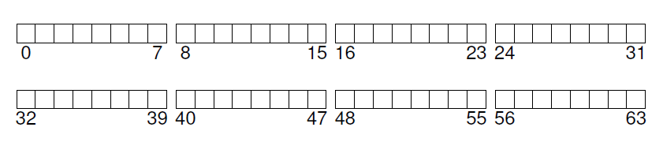
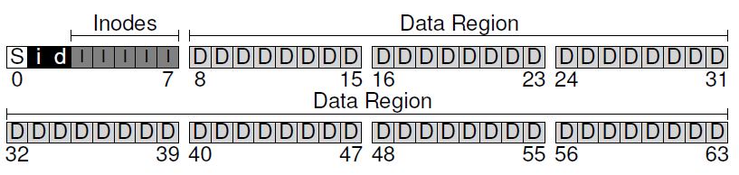
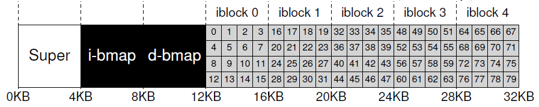
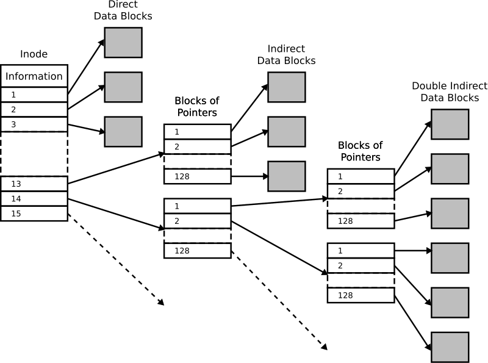
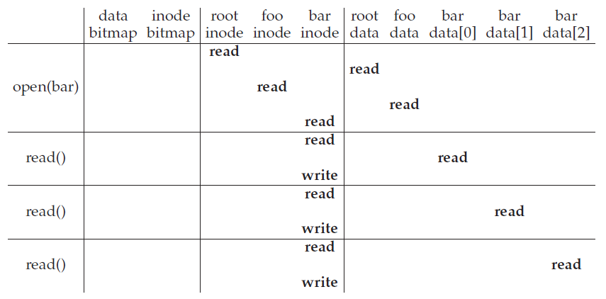
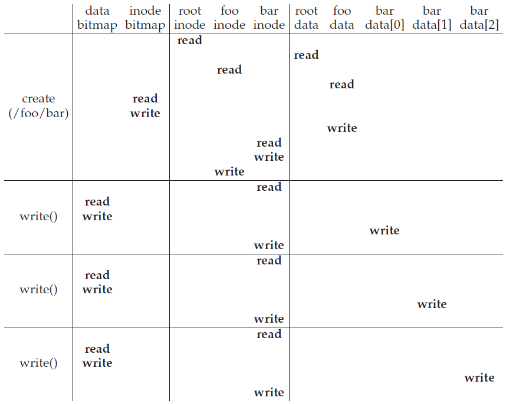
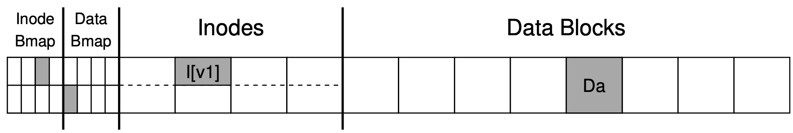
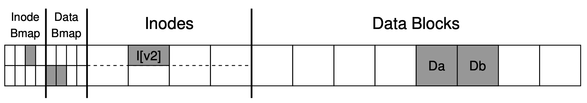
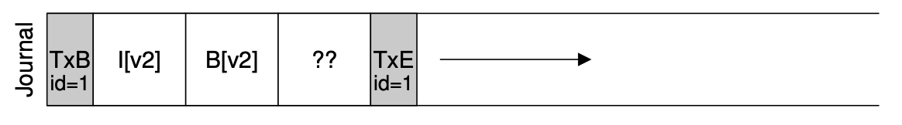

操作系统基础 - 文件系统

# 前言

本文以一个非常简单的文件系统vsfs(Very Simple File System)为例，介绍文件系统实现需要注意的几个要素。我们可以从两个角度来看待文件系统：

1. 文件系统的数据结构是怎么组织的，文件数据和元数据在磁盘上是怎么存放的？
2. 访问文件系统的方法，当我们打开、读取或写入一个文件时，需要读写哪些数据结构？

# 数据结构

## 物理块和逻辑块

我们可以把一个磁盘看做是一个大的数组，每个数组成员的大小通常是512字节，这是磁盘控制器所能够读写的最小单元，称之为物理块。换句话说，假设计算机需要修改某个块中1个字节，磁盘控制器必须把整块512字节的内容读取出来，修改这1字节，再把512完整地写回磁盘中。而文件系统所能读写的最小块，称之为逻辑块，它的大小一般在512字节到16KiB之间，因此一个逻辑块会对应一个或多个连续的物理块，典型的逻辑块大小通常是是4KiB。假设这里有一个很小的只有256KiB的磁盘，我们可以把它划分成64个4KiB的逻辑块，编号0-63：

> 为什么逻辑块跟物理块的大小不同？为什么典型的逻辑块大小是4KiB？我没找到明确的结论，这可能跟page cache的大小有关，一个4KiB逻辑块的内容正好映射到4KiB的page cache中，从而简化了设计。实际上，现在越来越多磁盘也开始采用4KiB的物理块大小了。另一方面，4KiB是个常见的magic number，如果不知道多大合适，通常4KiB是个不坏的选择。

## 磁盘空间划分

不难想象，磁盘的大部分都应该做作为数据区（Data Region），用来保存文件的实际内容；同还需要一部分空间作为元数据来索引这些文件，最简单的做法就是按照比例来划分。

元数据通常会放在磁盘的起始部分，其数据结构需要考虑以下几点：

- 用来索引数据块的i节点（inode），每个i节点代表了一个文件或者目录。
- 用来记录数据块和i节点是否已经分配的数据结构，这里我们采用了两个bitmap：
  - indoe map（图中的i）记录i节点的分配情况
  - data map（图中的d）记录数据库分配情况
- 最后是超级块，里面保存了文件系统的类型，i节点和数据块的个数等信息。

## i节点

每一个文件，比如/foo/bar，/abc在文件系统上都有一个i节点描述它的元信息，i节点是索引节点（index node）的简称，因为最早是以数组的形式来保存i节点的，如下图所示。假如每个i节点的大小是256，这5个4KiB的逻辑块一共可以保存80个i节点。

> 常见的文件系统会根据磁盘的大小，通过固定的比例来分配i节点的数量，这样的好处是设计和实现和简单。我们有时候会遇到文件系统报磁盘满了的错误，而通过df命令却看到磁盘空间还很空闲的情况，这是因为i节点用完了。像是ReiserFS之类的文件系统是动态分配i节点的，它们不会出现这种情况。

i节点中包含了文件所有除了内容以外的所有相关信息，以一个ext2的i节点为例，它包含了以下字段：

| 大小 | 字段名      | 用途                           |
| ---- | ----------- | ------------------------------ |
| 2    | mode        | 这个文件是否可读/可写/可执行？ |
| 2    | uid         | 谁拥有这个文件？               |
| 4    | size        | 这个文件包含多少字节？         |
| 4    | time        | 文件的最后访问时间             |
| 4    | ctime       | 文件的创建时间                 |
| 4    | mtime       | 文件的最后修改时间             |
| 4    | dtime       | 这个i节点是什么时候删除的      |
| 2    | gid         | 这个文件属于哪个用户组         |
| 2    | links_count | 这个文件一共有几个硬链接       |
| 4    | blocks      | 这个文件分配了多少个逻辑块     |
| 4    | flags       | ext2该怎么使用这个i节点        |
| 4    | osd1        | 操作系统相关的字段             |
| 60   | block       | 一组指向磁盘的指针(一共15个)   |
| 4    | generation  | 文件版本（NFS使用）            |
| 4    | file_acl    | acl 是一种新的权限控制模型     |
| 5    | dir_acl     |

### 多级索引

在i节点的设计中最重要的决策就是如何保存数据节点的磁盘地址，通用的做法是多级索引(Multi Level Index)，以ext2为例，它的15个block指针中，前12个叫做direct pointer，每一个都直接指向数据区中的一个4KiB的数据块，里面保存的是用户的文件数据。通过direct pointer一个indoe一共只能保存48KiB的数据，如果文件大小超过这个范围，ext2会分配一个indirect pointer（即第13个block指针），它指向一个特殊的数据块，里面保存的是一组指向用户文件数据的direct pointer。假设磁盘地址是4字节，一个indirect pointer可以包含1024个direct pointer，一共可以保存4096KiB的数据。如果文件大小继续增长的话，ext2还会分配double indrect pointer（即第14个block指针） 和 triple indrect pointer（即第15个block指针）,如下图所示：

为什么要用这种多级索引的设计？根本原因是大部分文件都是很小的，Agrawal等人在2007年做过一个调查发现：
|                            |                                                           |
| -------------------------- | --------------------------------------------------------- |
| 大部分文件都是很小         | 最常见的大小在2KiB左右                                    |
| 文件的平均大小正在增长     | 平均文件大小约200KiB                                      |
| 大部分的数据都存在大文件中 | 几个大文件占用了多数的空间                                |
| 文件系统包含很多文件       | 平均约有10万个                                            |
| 文件系统大约只使用了一半   | 虽然磁盘的大小在增长，但是文件系统保持了约50%的空间使用率 |
| 目录通常很小               | 很多目录只有几个文件，大部分目录的文件数在20个以下        |

> 作为对比，ext4采用了extents的方案，一个extent就是一个磁盘指针加上一个（逻辑块的）长度，一个文件通常会包含多个extent。读者朋友不妨思考下这两种方式在不同场景下的优劣。

## 目录

文件系统中的目录也对应一个i节点，它指向的数据块中包含了文件的索引，在vsfs中它是一个简单的列表。表中的每一项都包含以下内容：
- inum: 文件的i节点号(inode number)
- reclen：该记录的长度
- strlen：文件名的长度
- name：以及实际的文件名

假设目录`dir`对应的i节点 number为5，并且它包含3个文件（foo，bar和foobar_is_a_pretty_longname)，它对应的记录项如下：

| inum | reclen | strlen | name                        |
| ---- | ------ | ------ | --------------------------- |
| 5    | 12     | 2      | .                           |
| 2    | 12     | 3      | ..                          |
| 12   | 12     | 4      | foo                         |
| 13   | 12     | 4      | bar                         |
| 24   | 36     | 28     | foobar_is_a_pretty_longname |

其中开头的一项名字为`.`，其i节点号也指向5，表示这个目录本身。第二项`..`指向其父目录。

# 访问路径

介绍完vsfs的数据结构后，我们来看看访问一个文件需要经过什么路径，下面以读取和写入一个文件为例：

## 读取文件

假设我们要打开一个叫/foo/bar的文件，然后发起3次读请求，为了简单起见，假设每次读取的大小都是4KiB（即逻辑块大小），其时间线如下：

首先读取根目录的i节点（通常是一个固定的位置，也可能包含在超级块的信息中，惯例是编号为2的i节点），根据i节点的block指针从中读取根目录的数据块，从这个数据块中找到foo目录对应i节点号。接下来读取foo目录的i节点，然后读取其的数据块，从中找到bar文件的i节点号。最后读取bar文件的i节点，完成了打开文件(open)的过程。

当发起read()系统调用读取bar的内容时，首先从i节点中找到它第一个block指针，把对应的内容读入内存，然后文件系统会更新i节点中的最后访问时间（atime），因此触发了一次write操作。如此类推，最终完成3个逻辑块的读取。

## 写入文件

类似的，假如我们要在/foo目录下面创建bar文件，再发起3次大小为4KiB的write请求，其时间线如下：

首先读取根目录的i节点，根据i节点的block指针从中读取根目录的数据块，从这个数据块中找到foo目录对应i节点 number，接下来读取foo目录的i节点，然后读取其的数据块。到此为止，这里的过程跟读取文件时一致的。

接下来需要给bar文件分配一个i节点，因此我们先读取inode bitmap，找到一个空闲i节点号，把这个位置标记为已分配，然后写回bitmap。有了i节点号之后，文件系统需要在/foo的记录表中添加foo文件的项，因此触发了一个write操作。最后，需要把foo的i节点信息写入i节点表中，由于i节点的大小（通常为128或256字节)小于物理块大小（通常为512字节），因此还需要把i节点所在的物理块内容读取进来写入foo文件的i节点再写回磁盘中。至此完成了文件创建的过程。

当发起write()系统调用往bar文件写入内容时，首先要从i节点的block指针中找到最后一个块的位置（对于刚创建的文件就是第一个指针）。接下来文件系统需要为bar文件分配一个数据块，因此读入data bitmap，找到一个空闲的逻辑块，标记为使用后写回。有了这个逻辑块位置之后，首先往这个位置写入数据内容， 最后更新indoe的block指针，这样i节点就跟数据块关联起来了。

# Fast File System

vsfs跟最早的unix文件系统很相似，这个设计有一个很严重的问题，随着时间的推移，文件系统最后只能利用磁盘2%的带宽。为什么会这样？我们知道机械磁盘读写一个块的时候，需要一个寻道和旋转的时间才能最终发起请求。在vsfs中，inod位于磁盘的最外圈，数据块在内圈，写入数据的时候要多次寻道，因此无法发挥磁盘的性能。

Fast File System把磁盘分为多个块组（block group），每个组都包含有i节点等元数据和数据块，当为i节点分配数据块的时候尽可能把分在同一个块组或者临近的块组，通过空间局部性原理解决了这个问题。Linux的EXT系列文件系统也采用这种设计。

*多个块组*

*一个块组的内部结构*

# 数据一致性

从前面的描述中我们知道，在文件系统新写入一个数据块需要发起多次IO，如果在这个过程中因为断电、内核bug等各种原因导致这些数据没有完整的写入，会导致文件系统的数据不一致。来看一个例子，这里有一个很小的块组，一共8个i节点和8个数据块，其中i节点号 3 代表了一个文件，文件的内容指向数据块4，大小为4KiB。

假设我们要往文件中追加4KiB的内容，文件系统需要更新3个位置的数据：data bitmap(B[V2])，i节点(I[V2])，以及新分配的数据块(Db)，正常情况下所有数据写进去之后，新的块组分配情况如下：

然而由于文件系统设计，或是写缓存的原因，磁盘可能会以不同的顺序写入这些位置，如果在这个过程中断电，会导致不同的结果。

| 场景 | B[V2] | I[V2] | Db   | 结果                                                                                                           |
| ---- | ----- | ----- | ---- | -------------------------------------------------------------------------------------------------------------- |
| 1    | ok    | ok    | ok   | 这是正常的情况，文件系统数据一致                                                                               |
| 2    | ok    | ok    | fail | 数据未写入，读取的时候会读取到未初始化的脏数据                                                                 |
| 3    | ok    | fail  | ok   | dmap和数据块已分配却未被i节点引用，造成磁盘空间泄漏                                                            |
| 4    | ok    | fail  | fail | dmap引用的数据块分配了却未被i节点引用，造成磁盘空间泄漏                                                        |
| 5    | fail  | ok    | ok   | i节点引用了数据块，其内容也是正确的，但是dmap认为这个数据块未使用，因此文件系统可能会把这个块分配给另一个i节点 |
| 6    | fail  | ok    | fail | i节点引用了数据块，但内容是脏数据，同时dmap认为这个数据块未使用，因此文件系统可能会把这个块分配给另一个i节点   |
| 7    | fail  | fail  | ok   | 仅写入数据块，但是未被dmap和i节点引用，相当于这个写入丢失了，但但是文件系统数据一致                            |
| 8    | fail  | fail  | fail | 没有任何数据写入，文件系统数据一致                                                                             |

> 在最后两个场景中，文件系统数据是一致的。然而从应用的角度来说，它未必如此，比如应用发起写请求自之后回复客户端写入成功，而实际上这些数据丢了。

然而从文件系统的角度，我们只要保证文件系统内部的数据一致性即可，常用的机制包括文件系统一致性检查（fsck）和日志（journaling）

## Fsck

Fsck是File System Consitency checKer 的缩写，如果上一次文件系统没有正常地卸载（umount)，或者在挂载一定次数后，在下一次挂载文件系统前会触发fsck。fsck会扫描文件系统上的所有数据结构，试图发现并修复前面描述的不一致的情况。大体来说，fsck会尝试扫描以下内容：

- 超级块：如果超级块损坏，会尝试使用副本
- 空闲数据块是否与i节点的block指针一致
- i节点的状态和链接数
- 是否有不同的i节点指向同一个数据块
- i节点的block是否指向不合法的磁盘地址
- 目录项检查：比如是否都包含了`.`和`..` 这两项

随着磁盘大小的增长，fsck的缺点越来越明显，它太慢了，扫描一个1TiB的磁盘可能需要几个小时。这个设计的缺陷在哪里？当故障发生时，存在一致性问题的可能只有几个逻辑块，但是fsck却必须扫描整个磁盘，这无异于大海捞针。

## Journaling

另一种解决方案叫做日志(Journaling)，在数据库技术中叫做Write Ahead Logging，其基本思路是，在实际往磁盘写入数据之前，一次性把所有要写入的内容（即日志包括bitmap，i节点，数据块）先写到磁盘的某个地方，然后再实际写入data bitmap，i节点和数据块。比如ext3就在超级块后面分配一部分空间用来写Jouranling：

在Journal中包含多条日志，它的格式类似这样：以一个事务ID（TxB）开头，中间是要写入的实际内容，最后以写入一个TxE作为事务的结尾。

当发生故障后重新挂载文件系统时，首先重放Jouranl里面所有有效的日志，即按照日志的描述把对应的位置重新写入一遍，当重放完所有日志或遇到无效的日志时停止这个过程。什么是无效的日志？一种情况，如果有某条日志只有TxB没有TxE，它是无效的，因为故障发生时没来得及把TxE写进去。另一种情况是日志的格式看似完整，但是可能由于磁盘内部调度算法等原因部分日志并没有写入，如下图所示：

以ext4为例，它的解决方案是在写入日志的同时写入其checksum，如果计算出来的checksum与保存的不匹配，这个日志就是无效的。

前面描述的模式叫做data journaling，因为它会在日志中也包含一份数据块的副本。一个常见的优化叫做metadata journaling，它的写入分成三步：

1. 直接写入数据块
2. 把对应的data bitmap和i节点写入到Jouranl 中，这里不再包含数据块
3. 最后更新实际的data bitmap和i节点

ext3/4中提供了一个data参数来控制日志的行为，journal对应data journaling；ordered对应metadata journaling，这个是默认值；它还有一种模式叫做writeback，类似metada journaling，但是它不保证步骤1和2的顺序，因此数据块中可能是老的未初始化的数据（即数据一致性中的场景2），不建议使用。