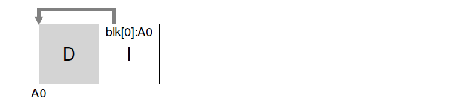
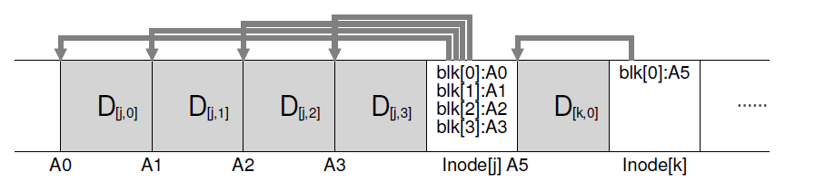
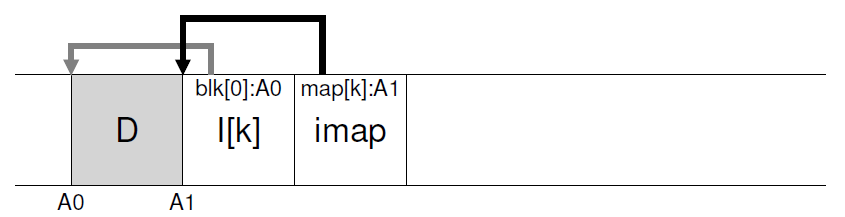
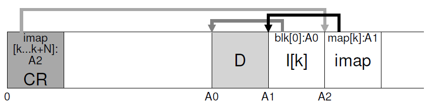
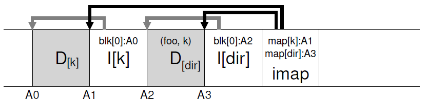
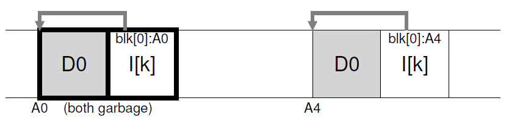
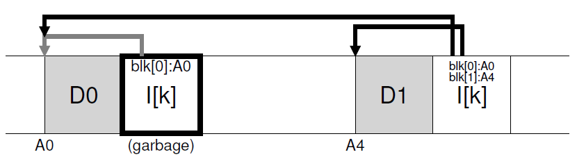

# 前言

上世纪90年代，伯克利的Jhon Ousterhout带领一个小组开发了一个新的文件系统来尝试解决文件系统的性能问题，这个研究成果就是Log-structured File System(LFS)，然而多年以来它并没有得到业界的采纳，直到固态硬盘（Solid State Drive)兴起后，LFS终于大放异彩。

# Log-Structured File System

## 设计思路

LFS的设计思路来自于以下几点观察：

- 内存变得越来越大，能够缓存越来越多的东西，因此文件系统的性能更多被写入性能所主宰
- 磁盘的随机I/O和顺序I/O的性能相差巨大，如果能把大部分I/O都转换成顺序I/O，将能极大地提高性能
- 现有的文件系统在许多常见的工作负载下表现都不如意：它们的元数据和数据块是分开的，文件系统写入一个数据块要多次寻道和旋转，虽然FFS通过块组缓解了这个问题，但是依然避免不了大量短距离的寻道和旋转。
- 文件系统感知不到RAID，难以避免RAID-4/RAID-5的small write问题，即一个小块的数据写入会导致4次物理I/O。

因此，LFS尝试优化磁盘写入性能，尽可能地使用连续I/O，对于磁盘的读取性能则寄希望于内存能缓存更多内容。这个出发点导致了它的数据结构不同与常见的文件系统。

## 连续写入

LFS所尝试的第一个优化就是在写入数据块的时候，同时在后面写入数据块的inode，比如下图在磁盘地址A0写入一个数据块之后再把它的inode写到后面:

然后对于大量小块的I/O，这样是不行的，LFS采用了写缓存技术，先在内存中缓存一定的大小写请求，直到达到一个足够大的值（LFS中称为segment），然后再一次性写入磁盘中。因此LFS的一次I/O通常会包含多个数据块和inode：

那么，多大的segment是合适的呢，这跟磁盘性能有关系，假如说我们希望磁盘95%的时间都在写入，只有5%的时间再寻道，对于一个写入速度为100MiB/s的磁盘来说，这个segment约为9MiB。这里忽略了计算公式，有兴趣请参考[43 Log-structured File System (LFS)](http://pages.cs.wisc.edu/~remzi/OSTEP/file-lfs.pdf)。

## inode

读者们肯定能注意到，数据块和inode混在一起之后，LFS要怎么找到这些inode？我们可以用一个map结构来存储inode，其key是文件的inode number，value是inode再磁盘上的地址，称之为inode map（或imap）。考虑到LFS的设计，imap不应该存储在磁盘的某个特定位置，这会引起来回寻道的问题，因此LFS在一个写I/O的最后把最新的imap也一起写进来了。

下一个问题是，LFS怎么知道最新的imap在什么地方？它必须得把最新imap的地址写在磁盘的某个地方，这就是checkpoint region(CR)。出于写入性能的考虑，CR一般30秒左右才更新一次，因此对性能的影响可以忽略。

> 事实上，LFS有两个CR，见后文。

## 目录

前面的讨论仅涉及了文件，其实目录也是类似的，假如在某个目录/dir下面创建了一个叫foo的文件：
- LFS首先写入foo的内容和inode
- 然后写入目录D的内容，即inode number和磁盘地址的映射关系，如下图中的（foo,K)，以及这个目录新的inode
- 最后写入写的imap

## 文件读取

LFS挂载后，会先读入CR，再根据CR的内容把imap缓存到内存中，之后这两个数据结构的更新就按照上面的描述进行更新，imap再每次写I/O后追加到尾部，CR则定期写入。

从LFS读取一个文件如/dir/foo时，首先从imap缓存中找到根目录/的inode地址（比如根据约定的inode number 2)，读取其内容找到dir目录对应的inode number，再根据inode number从imap中找到dir对应的inode number，如此类推直到读入foo的inode，这之后的过程就跟普通unix文件系统没太大区别了，inode里面有direct pointer, indirect pointer... LFS没有对读取做什么优化，而是寄希望于越来越大的内存能够缓存更多的inode和数据块。

## 垃圾回收

LFS写入新的数据块时，总是寻找一片连续的空闲磁盘空间，然后写入整个segment，因此磁盘中其实充满了过时的数据。比如下面的i节点号为K的文件一开始保存在磁盘地址A0，当这个文件的内容更新的时候，LFS在磁盘地址A4写入了数据块和inode，此时A0和A1的数据就是过时的：

另一个例子，假设用户往文件中追加了一个块（A4），这种情况下过时的数据只有老的inode（A1）：

在ZFS，btrfs等吸收了LFS设计思路的文件系统中，允许用户保留这些老版本的文件作为snapshot，这种方法就是著名的copy on write；而在LFS中，只保留最新版本的文件。

不论如何，这些文件系统最终都需要回收这些不再使用的、过时的数据。一个简单的实现是扫描这些数据，发现过时的数据就标记为空闲，但是这样会造成大量的磁盘碎片。在LFS的实习中，定期启动一个cleaner线程，读出几个segment的数据，其中过时的数据会被直接丢弃，剩余的块则会合并到新的segment中写入磁盘。这个方式保证了磁盘的数据大致是连续的，比较容易在写入时找到大片的空闲空间。