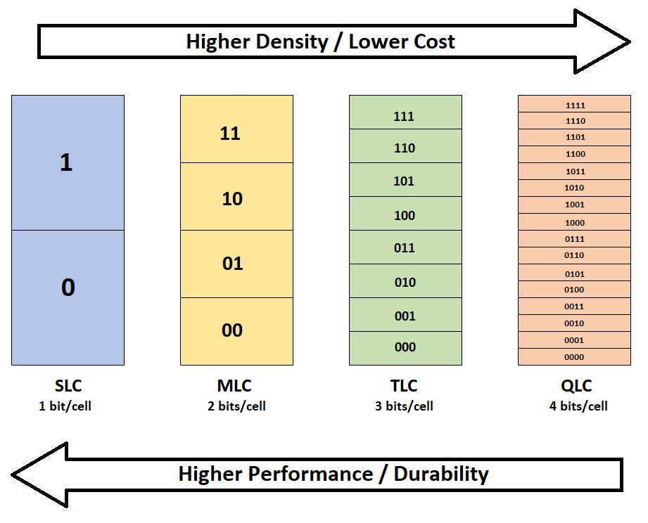
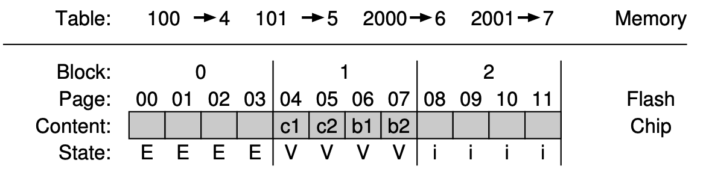

操作系统基础 - LFS和SSD

# 前言

上世纪90年代，伯克利的Jhon Ousterhout带领一个小组开发了一个新的文件系统来尝试解决文件系统的性能问题，这个研究成果就是Log-structured File System(LFS)，然而多年以来它并没有得到业界的采纳，直到固态硬盘（Solid State Drive)兴起后，LFS终于大放异彩。

# Log-Structured File System

## 设计思路

LFS的设计思路来自于以下几点观察：

- 内存变得越来越大，能够缓存越来越多的东西，因此文件系统的性能更多被写入性能所主宰
- 磁盘的随机I/O和顺序I/O的性能相差巨大，如果能把大部分I/O都转换成顺序I/O，将能极大地提高性能
- 现有的文件系统在许多常见的工作负载下表现都不如意：它们的元数据和数据块是分开的，文件系统写入一个数据块要多次寻道和旋转，虽然FFS通过块组缓解了这个问题，但是依然避免不了大量短距离的寻道和旋转。
- 文件系统感知不到RAID，难以避免RAID-4/RAID-5的small write问题，即一个小块的数据写入会导致4次物理I/O。

因此，LFS尝试优化磁盘写入性能，尽可能地使用连续I/O，对于磁盘的读取性能则寄希望于内存能缓存更多内容。这个出发点导致了它的数据结构不同与常见的文件系统。

## 连续写入

LFS所尝试的第一个优化就是在写入数据块的时候，同时在后面写入数据块的inode，比如下图在磁盘地址A0写入一个数据块之后再把它的inode写到后面:

然后对于大量小块的I/O，这样是不行的，LFS采用了写缓存技术，先在内存中缓存一定的大小写请求，直到达到一个足够大的值（LFS中称为segment），然后再一次性写入磁盘中。因此LFS的一次I/O通常会包含多个数据块和inode：

那么，多大的segment是合适的呢，这跟磁盘性能有关系，假如说我们希望磁盘95%的时间都在写入，只有5%的时间再寻道，对于一个写入速度为100MiB/s的磁盘来说，这个segment约为9MiB。这里忽略了计算公式，有兴趣请参考[43 Log-structured File System (LFS)](http://pages.cs.wisc.edu/~remzi/OSTEP/file-lfs.pdf)。

## inode

读者们肯定能注意到，数据块和inode混在一起之后，LFS要怎么找到这些inode？我们可以用一个map结构来存储inode，其key是文件的inode number，value是inode再磁盘上的地址，称之为inode map（或imap）。考虑到LFS的设计，imap不应该存储在磁盘的某个特定位置，这会引起来回寻道的问题，因此LFS在一个写I/O的最后把最新的imap也一起写进来了。

下一个问题是，LFS怎么知道最新的imap在什么地方？它必须得把最新imap的地址写在磁盘上一个固定的地方，这就是checkpoint region(CR)。出于写入性能的考虑，CR一般30秒左右才更新一次，因此对性能的影响可以忽略。

## 目录

前面的讨论仅涉及了文件，其实目录也是类似的，假如在某个目录/dir下面创建了一个叫foo的文件：
- LFS首先写入foo的内容和inode
- 然后写入目录D的内容，即inode number和磁盘地址的映射关系，如下图中的（foo,K)，以及这个目录新的inode
- 最后写入写的imap

## 文件读取

LFS挂载后，会先读入CR，再根据CR的内容把imap缓存到内存中，之后这两个数据结构的更新就按照上面的描述进行更新，imap再每次写I/O后追加到尾部，CR则定期写入。

从LFS读取一个文件如/dir/foo时，首先从imap缓存中找到根目录/的inode地址（比如根据约定的inode number 2)，读取其内容找到dir目录对应的inode number，再根据inode number从imap中找到dir对应的inode number，如此类推直到读入foo的inode，这之后的过程就跟普通unix文件系统没太大区别了，inode里面有direct pointer, indirect pointer... LFS没有对读取做什么优化，而是寄希望于越来越大的内存能够缓存更多的inode和数据块。

## 垃圾回收

LFS写入新的数据块时，总是寻找一片连续的空闲磁盘空间，然后写入整个segment，因此磁盘中其实充满了过时的数据。比如下面的i节点号为K的文件一开始保存在磁盘地址A0，当这个文件的内容更新的时候，LFS在磁盘地址A4写入了数据块和inode，此时A0和A1的数据就是过时的：

另一个例子，假设用户往文件中追加了一个块（A4），这种情况下过时的数据只有老的inode（A1）：

在ZFS，btrfs等吸收了LFS设计思路的文件系统中，允许用户保留这些老版本的文件作为snapshot，这种方法就是著名的copy on write；而在LFS中，只保留最新版本的文件。

不论如何，这些文件系统最终都需要回收这些不再使用的、过时的数据。一个简单的实现是扫描这些数据，发现过时的数据就标记为空闲，但是这样会造成大量的磁盘碎片。在LFS的实习中，定期启动一个cleaner线程，读出几个segment的数据，其中过时的数据会被直接丢弃，剩余的块则会合并到新的segment中写入磁盘。这个方式保证了磁盘的数据大致是连续的，方便在写入时找到大片的空闲空间。

# Solid State Drive

这里的Solid state disk（简称SSD）特指基于NAND Flash的存储设备，SSD不一定需要基于Flash，但是目前NAND Flash是SSD事实的标准，在深入SSD之前我们先了解Flash的特性。

## Flash芯片组成

跟磁盘相比，它没有任何机械组件。。Flash芯片最底层的存储单元叫做cell，一个cell可以存储一个或者多个bit：
- 只存储一个bit的cell叫做single-levle cell(SLC)
- 存储两个bit的call叫做multi-level cell(MLC)
- 存储三个bit的call叫做triple-level cell(TLC)
- ……

总体来说SLC的性能最好成本最高，每个cell的存储的bit数量越多性能就越差，成本也越低。

- 多个cell组成一个page，这是flash存取数据的最小单元，它的大小通常是几KiB，比如4KiB
- 多个page组成一个block，它的大小一般是128KiB或256KiB
- 多个block组成一个bank或者叫（plane），一个flash芯片一般会包含若干个bank

下图是一个缩小了规模的Flash芯片

## Flash芯片的基本操作

Flash芯片的物理特性比较特殊，它最基本的底层操作有三种.

- 读取(read)一个page：flash芯片可以读取任意一个page，只要给出page号即可。不像磁盘，ssd是一种随机存取设备，它没有机械部件，存取任意一个位置的速度都是一样的，读操作通常只要10微秒(10^-5)左右。

- 擦除(erase)一个block：flash的物理特性要求在写入一个page之前，先擦除改page所在的整个block，整个个操作很慢，一般需要几毫秒(10^-3)。这个操作会把整个block里面每一个比特都设置成1，因此在擦除前需要复制出里面有价值的数据。block擦除完成之后就能够进行编码（或者说写入）。

- 编码(Program)一个page：在擦除一个block之后，flask可以把里面的一些比特从1改成0，因此把想要的内容写入page中。编码操作通常需要100微秒左右（10^-4)。

总的来说，读取的速度远快于编码的速度，而编码的速度又快于擦除的速度。

我们可以换种角度来看待这个问题，page的初始状态是Invalid，当擦除它所在的block后状态变为Erased，当编码这个page后它的状态变为Valid。以一个只有4个page的block为例：

| 操作           | 状态   | 说明                                     |
| -------------- | ------ | ---------------------------------------- |
| 初始状态       | `iiii` | 初始状态，block中的4个page都是Invliad(i) |
| 擦除block      | `EEEE` | block中4个page的状态变为Erased(E)        |
| 编码page 0     | `VEEE` | page0的状态变为Valid(V)                  |
| 再次编码page 0 | 错误   | 不允许重复编码一个page                   |
| 编码page 1     | `VVEE` |                                          |
| 擦除block      | `EEEE` | 擦除block后，4个page都变成可编码的状态   |

## Flash磨损

由于没有机械部件，flash的可靠性比磁盘要高很多，不会出现类似磁头划碰的问题，但是flash也有它的弱点，即磨损(wear out)：每次擦除一个block或编码一个page时，都会造成一些轻微的损耗，这些损耗积累下来后最终会导致无法区分0和1，这时候这个block就变得不可用了。一般一个基于MLC的芯片生命周期大约是10,000P/E（Program/Erase），也就是说每个block在失效前可以反复擦除和写入10,000次，而基于SLC的芯片生命周期大概是100,000P/E。

## 从Flash芯片到SSD

前面我们描述了Flash芯片的组成，而一块SSD中会包含多个Flash芯片，它们连接到一个Flash控制器上，Flash控制器对外提供了一个磁盘设备的接口，更有趣的是Flash控制器还连着一小块内存。这片内存可以用来作为I/O的缓存，同时还保存了物理块到Flash 芯片的page的映射关系。

为什么SSD中需要这样一个映射关系？假设我们采用一种最简单的映射关系，把物理块0映射到第0个Flash芯片上第0个page，把物理块1映射到第0个Flash芯片上第个page……这种简单的映射有两个问题，主要出现在更新的场景：
- 一是性能上的，我们直到page在写入前需要先擦除，这种原地更新导致了三次I/O操作，
  1. 读出整个block，并在内存中更新对应的内容
  2. 擦除整个block，而flash擦除的速度很慢，跟磁盘基本是一个量级的
  3. 重新写入block
- 第二个问题是，经常更新的磁盘区域（比如swap和/tmp分区）会严重磨损，成为SSD寿命的短板

## Flash Translation Layer

因此，Flash控制器最核心的功能就是，在主机发起I/O请求时，动态地完成物理块到SSD内部page的转换，这就是Flash Translation Layer(FTL)，它的目标有几个：
1. 并行地利用多个Flash芯片
2. 减少写放大
3. 使得Flash的磨损尽可能的平均

太阳底下无新事，前者可以借鉴RAID，后两者可以从LFS中得到启发。大多数FTL的实现都类似于log-structured file system，当主机往SSD写入内容的时候，先在SSD的内存中缓存一定的大小，然后找到一片空闲的区域一次性的写入；同时SSD的内存和Flash中维护一个物理块和SSD内部page的映射表，即mapping table。假设主机进行了这一系列的操作：
- 往物理块100写入内容a1
- 往物理块101写入内容a2
- 往物理块2000写入内容b1
- 往物理块2001写入内容b2

这一系列的操作会由FTL合并写入到一片临近的区域中，如下图所示，图上Table部分即mapping table。

## 垃圾回收

假设主机接下来需要修改物理块100和101的内容，分别改成了c1和c2，FTL不会原地修改，而是直接写入到后续的空闲page中，同时在mapping table中修改物理块100和101对应的page为4和5:

此时page 0和1中的数据是过时的，如果需要回收这两个page，FTL必须先把同一个block中有效的数据（page2和3）读取出来，写入到后续的空闲空间中，这个时候整个block0都是过时的数据，FTL才能擦除这个block。

## mapping table 大小

按照上面的方式把一个物理块映射到ssd的一个page，如果这两者的大小都为4KiB，对于一个1TiB的SSD来说，mapping table需要有1TiB/4KiB
个条目，假设每个条目的大小大小为4字节的话，整个mapping table的大小需要1GiB，对于SSD的内存来说，这实在太大了。一种解决方案是只在SSD中缓存部分活跃的mapping，其余部分持久化到Flash中，如果工作集能满足局部性原理的话，这个方式能保持不错的性能。

另一种方案是把一大块物理块映射到SSD的一个block中，这样mapping table可以非常小，但是它有一个严重的问题，如果只修改block中一个或几个page时，FTL必须把整块内容读取出来，在内存中完成对应page的修改后，再把整个block的内容写到一个新的空闲block中。因此，实践中更常见的时混合mapping，FTL中有两个mapping table，基于page的映射叫log table，基于block的映射叫data table，如果物理块能连续的映射到一个block中则保存到data table，否则保存到log table中。