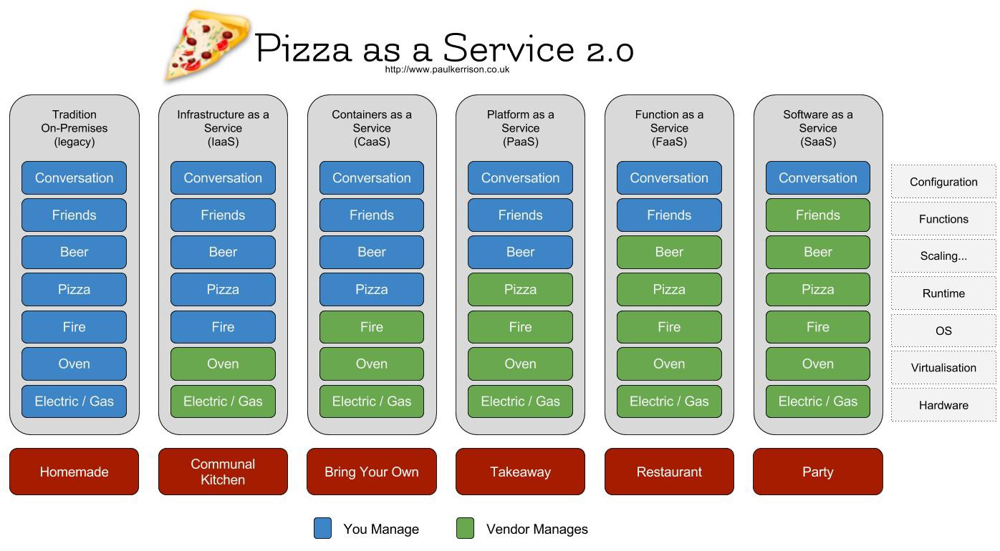
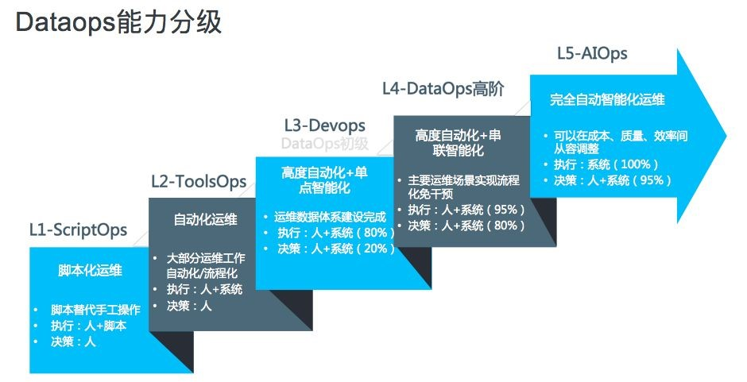

## 软件开发：瀑布流 vs 敏捷

???

- 传统瀑布流模型
  - 客户需求是事先确定的，经过漫长的分析、设计、开发、测试、部署，最终交付到客户手上。这个模式的确定是中间缺乏反馈过程。
  - 但是那个时候，软件可能是通过磁盘、光盘的形式递交给用户的，甚至可能硬件都是软件开发商（比如IBM）提供的，一旦发出就难以召回。
  - 通常用于内部系统，用户数量较少，部署的规模比较小，通常只部署一两台，性能问题通过垂直扩展解决——更快的cpu，更大的内存。
  
- 敏捷开发
  - 互联网时代的需求变化太快，传统的瀑布流模型难以满足，这个时代强调的是尽早上线，快速迭代。通过用户反馈调整需求。这个模式的问题嘛……
  - 通过刷新浏览器，或者自动更新，版本的迭代很快交付到用户手上。
  - 面前整个互联网，拥有海量用户，垂直扩展已经难以解决性能问题，转而采取扩展——更多的廉价的pc server，更多接入层，更多cdn……这也意味着更大的部署规模。
  
---

.footnote[
[Pizza as a Service 2.0](https://medium.com/@pkerrison/pizza-as-a-service-2-0-5085cd4c365e)
]

???

- On Premises: like a homemade pizza, made from scratch, you do everything yourself (no change so far). Example: Datacentre
- Infrastructure as a Service: You share a kitchen with others. The utilities and oven are provided, but you make and cook the pizza yourself. Example: EC2
- Containers as a Servic: You bring the pizzas but someone else uses their facilities and cooks the pizza for you. Example: ECS
- Platform as a Service: You order a pizza for collection, the pizzeria make and cook the pizza using their facilities. Example: App Engine
- Function as a Service: You go to a pizzeria with some friends. You order and then eat pizza made by the restaurant. You order drinks from the bar and they’re made for you. Example: AWS Lambda
- Software as a Service: You go to someone’s house for a party, they provide the pizza and invite others round for you to meet. Conversation with the guests is still your responsibility! Example: Gmail

---

## 运维体系发展阶段

.footnote-right[
[1] [从人肉到智能，阿里运维体系经历了哪些变迁？](https://102.alibaba.com/detail?id=184)
]

---

# 运维规模对比

.sparse[

 |        Good Old Days | Nowadays
---------|--------------|--
迭代速度 | 几个月一次   |几天一次，或一天几次
发布规模 |个位数        |成百上千
维护时间 | 定期停机维护 | Zero Down time
系统组件 | 服务器，网络设备，存储，操作系统，软件 | 前者加上虚拟化，虚拟网络，容器，中间件…… 

]

---

# 运维方法论

- 传统运维
  - 关注流程、关注业务、讲究ITIL，ISO标准体系，通常关注业务运行的高度稳定，高度一致性、集中性。传统运维
  - 自动化程度通常不高，但求运营稳定可靠
- 互联网运维
  - 关注网站响应、网站性能、关注灵活快捷、分布式、开放式，关注安全体系
  - 互联网大企业里，其运维自动化程度非常高（腾讯？？？？）
  - DevOps （SRE 可以看作是Google特色的DevOps）

.footnote[
- [传统运维 VS 互联网运维：从哪来，到哪去？](http://os.51cto.com/art/201605/510534.htm)
- https://resources.collab.net/devops-101/what-is-devops
]

  
---

# SCM (Source Control Manger)

.pull-left[

软件开发的过程需要经历非常多小的迭代，SCM用来
- 回溯每次迭代谁提交了什么修改
- 记录稳定的Release版本（Tag）

]

.pull-right[

常用SCM的演进：

- 中心式
  - VCS
  - SVN
- 分布式
  - GIT
]

---

# Integration (集成)

传统的软件架构是巨大的单一软件（Monolithic），比如Oracle DB……

- 开发需要多人协作，不同模块通常是由不同的开发人员负责的
- 完整的构建一个软件，以及集成测试非常耗时间 

--

因此常见的做法是

- 开发人员单独为自己的模块编写单元测试
- 不定期把代码提交到SCM进行合并
  - 间隔以天，或者星期为单位
  - 中间可能出现了大量的代码冲突 
- 不定期的统一构建和进行集成测试
  - 这个过程通常由人工触发
  - 构建和测试环境可能“不干净”
  
---

## Continuous Integration(CI/持续集成)

后面出现了SOA（Service-Oriented Architecture)和微服务…… 
- 每个模块作为单独的应用单独开发
- 减少了构建和集成测试的成本

--

因此能够…… 
- 一天多次构建，甚至每次提交进行构建
- 构建之后自动触发自动化的集成测试
- 在干净的构建和测试环境（虚拟机/容器）完成

--

这就是持续集成

> Continuous Integration (CI) is the process of automating the build and testing of code every time a team member commits changes to version control.

---

### Continuous Delivery(CD/持续交付)

持续交付是CI的一个扩展，它在CI的基础上多做了一件事，把构建后的结果组成可以交付部署的形式，比如打包成一个tgz或者rpm文件

--

### 常见的CI（持续集成）工具

- Jenkins
- Travis CI
- ……

---

## 传统的软件部署

- ISV通过CD等介质交付给客户
- 由系统管理员手工部署
- 中间可能需要停机维护

---

## Continuous Deployment(CD/持续部署)

- 通过CI测试后自动进行灰度发布
- 根据灰度发布的结果决定
  - 继续进行全量发布
  - 或是……回滚
  - 这里需要CD和监控的紧密合作
  
### 常见的持续部署工具

- Puppet
- Ansible
- SaltStack

---
class: inverse, center, middle

# 其他支撑系统

---

### Configuration Management Data Base(CMDB)

此配置并非应用程序的运行时配置。应用程序的配置指定了程序运行的各种参数，而 CMDB 的配置管理，强调的是运营管理的工程管理角度，将一切对象当做配置，可 CRUD，CMDB 对此进行统一归类、抽象、管理等工作。

常见的配置对象如：

1. 设备
1. 业务模块
1. 业务程序、CGI、文件
1. 设备类型
1. 城市、园区、机房、机架位、内网模块（设备所在位置）
1. 等等

???

为什么业务也需要CMDB的信息？

举例说明：

- CBS的cell server需要做三副本跨机架的容灾
- GFS数据流的链式复制需要根据IP减少对汇聚层交换机的压力

---

## 配置中心

这里的配置是我们常说的应用程序的运行时配置。当分布式系统中有大量集群的时候，怎么把这些集群的共性和特性提取出来进行管理？

.pull-left[
业界常用：
- zookeeper
- consoul
- etcd
]

.pull-right[
我们的尝试
- OssDB / ConfigDB
]

.footnote[
[ 一篇好TM长的关于配置中心的文章 ](http://jm.taobao.org/2016/09/28/an-article-about-config-center/)
]

---

## 监控系统

传统监控系统
- Zabbix
- Nagios

新一代监控系统
- Promethesu
  - 时间序列
  - 白盒监控