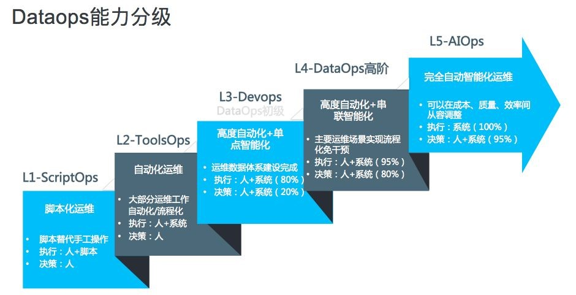

# Part I. 运维体系发展

# Part II. 运维方法论

# Part III. 核心组件

# Part IV. 未来趋势

---

# 软件开发：瀑布流 vs 敏捷

.image-75[

]

.footnote[
运维体系随着软件工程的变迁而发展
]

???

- 传统瀑布流模型
  - 客户需求是事先确定的，经过漫长的分析、设计、开发、测试、部署，最终交付到客户手上。这个模式的确定是中间缺乏反馈过程。
  - 但是那个时候，软件可能是通过磁盘、光盘的形式递交给用户的，甚至可能硬件都是软件开发商（比如IBM）提供的，一旦发出就难以召回。
  - 通常用于内部系统，用户数量较少，部署的规模比较小，通常只部署一两台，性能问题通过垂直扩展解决——更快的cpu，更大的内存。
  
- 敏捷开发
  - 互联网时代的需求变化太快，传统的瀑布流模型难以满足，这个时代强调的是尽早上线，快速迭代。通过用户反馈调整需求。这个模式的问题嘛……
  - 通过刷新浏览器，或者自动更新，版本的迭代很快交付到用户手上。
  - 面前整个互联网，拥有海量用户，垂直扩展已经难以解决性能问题，转而采取扩展——更多的廉价的pc server，更多接入层，更多cdn……这也意味着更大的部署规模。
  
---

# 运维体系发展阶段

.image-75[

]

.footnote[
[1] [从人肉到智能，阿里运维体系经历了哪些变迁？](https://102.alibaba.com/detail?id=184)
]

---

---

# 运维规模对比

.sparse[

 |        Good Old Days | Nowadays
---------|--------------|--
迭代速度 | 几个月一次   |几天一次，一天几次
发布规模 |个位数        |成百上千

]

---

# 运维方法论

